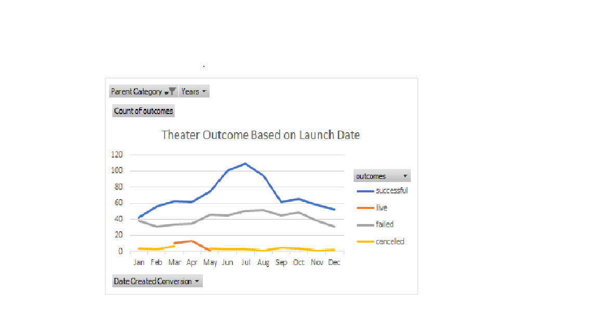
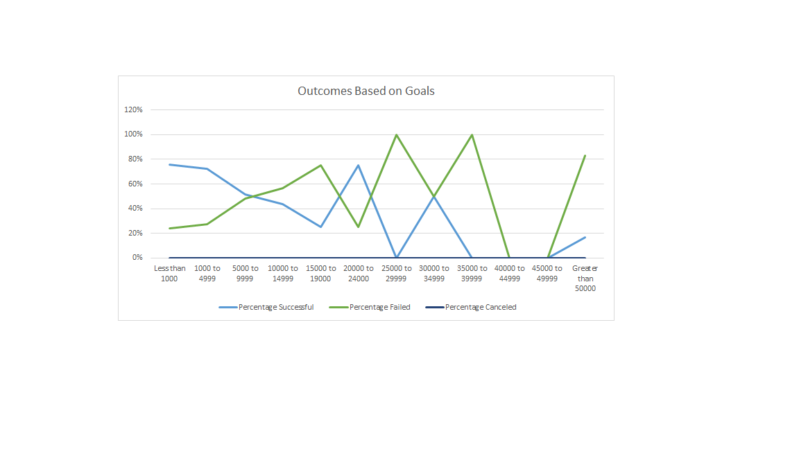

# "An Analysis of Kickstarter Campaigns."

# Kickstarting with Excel

## Overview of Project

# Purpose

**The purpose of this analysis** is to utilize information from the main **kickstarter** to **filter**,**formatting**,**generate formulas**, **pivot tables and pivot charts** to obtain perntiant information that can help the *protagonist* 

## Analysis and Challenges

The **Analysis** was performed by pregresively filtering the information listed in the kickstarter. Also, **Youtuve** was a good resouce to guide me through the **Pivot Tables and Pivot Charts**. [YouTube](https://www.youtube.com/watch?v=5vOqZBmBRos). **The challenges** I encountered were in the failed and cancelled results connected with the outcomes. I was able to overcome this by using 'fuctions' such has 'IFERROR', as well as a brief tutorial found in YouTube. The link for this is [YouTube page](https://www.youtube.com/watch?v=D_j3b5qzyO8) 

# Analysis of Outcomes Based on Launch Date

## Deriverable 1, 

-July was the month with most successful outcome rate, having 109
-June whad also had a good sucess with 101
-August is the third month capturing 94 successes

# Analysis of Outcomes Based on Goals

## Deriverable 2, 

-The higher goals tended to had very low performance in compare with those goals with less than 1000.
-Another *challenge* I had with this project is to be able to interpret the final data. Also, I am not quite sure what I am looking at. I am *open to suggestions*

### Challenges and Difficulties Encountered

*The challenges* I had were around dealing with 'zeros', which did not allow me to had a graph like the model was suggesting to get at the end.Also, The way the goals were placed made it harder for me to obtain the numbers I was looking for.

## Results

- What are two conclusions you can draw about the Outcomes based on Launch Date?

- **There were two erros in the cancelled outcome since the line in the graph appears discontinued**
- **The failed and success outcomes match or meet in the month of December**

- What can you conclude about the Outcomes based on Goals?

-Higher goals did not meet goal in compare with the lowest goals. Also, the numbers failed were still low in compare with the successes you can see in the graph.

- What are some limitations of this dataset?

-I think the margen for erros is higher since I obtained two rows with zeros in success, failed and cancelled. Therefore, I was unable to fix this error in the data set.

- What are some other possible tables and/or graphs that we could create?

- I am curious whether the combo chart can be utilize for this data set or not.

